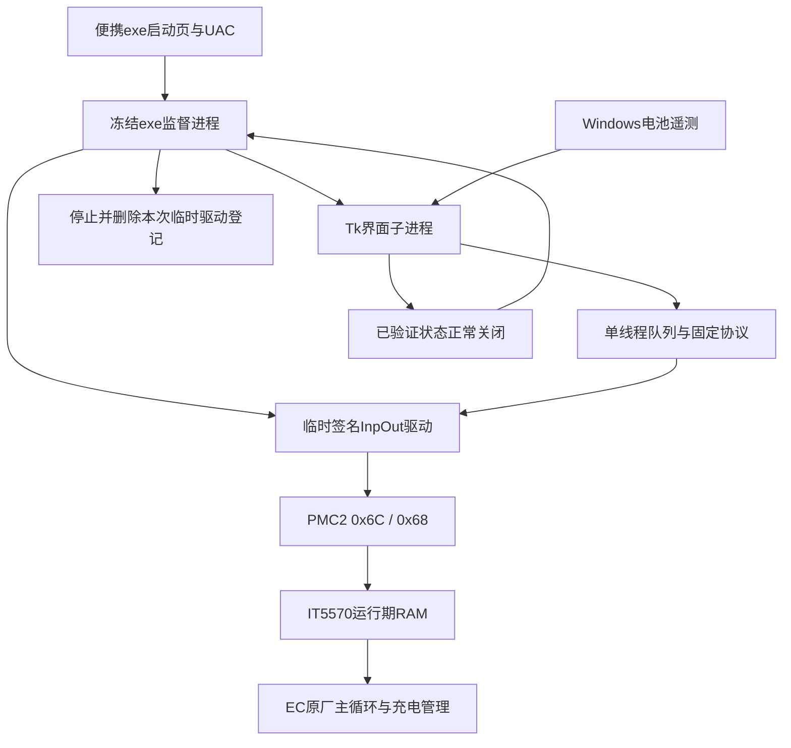

# 面板、监督进程与EC的控制链

设置参数后EC持续执行，窗口每15秒刷新，关闭后不再刷新。正常退出不取消成功设置的策略；驱动消失不等于策略消失。

tools/battery_panel.py负责UI、队列、日志和监督；battery_panel_core.py负责固定策略和完整状态验证；nlya_pmc2_query.py负责固定地址读取；nlya_policy_trial.py提供当前面板导入的传输、遥测与恢复判据；inpout_status_probe.py负责签名与服务生命周期。widgets与dpi模块只负责绘制。

控制意图在I/O前持久记录。完整事务之前置unsafe，完成后才置safe；未完成事务、读回异常和恢复故障跨启动形成门控。正常退出需要关闭标记、有效末次状态、没有未完成/故障及子进程exit0共同成立。日志失败时仍努力清理驱动，但不会声明正常退出通过。

冻结exe绘制进程在创建Tk前设置DPI上下文，以DPI/72设字体、DPI/96换算布局。每个绘制子进程独立初始化。当前仅启动时按显示器工作区初始化；运行中跨不同DPI显示器自动重排未实现/验收。

quanta_bridge_probe.py是原厂CCDRV1历史探测及模拟测试依赖，未使用的原厂二进制不随包发布；它不是生产入口。nlya_policy_trial.py的独立短时实验也不是日常入口，不批量执行tools脚本。
